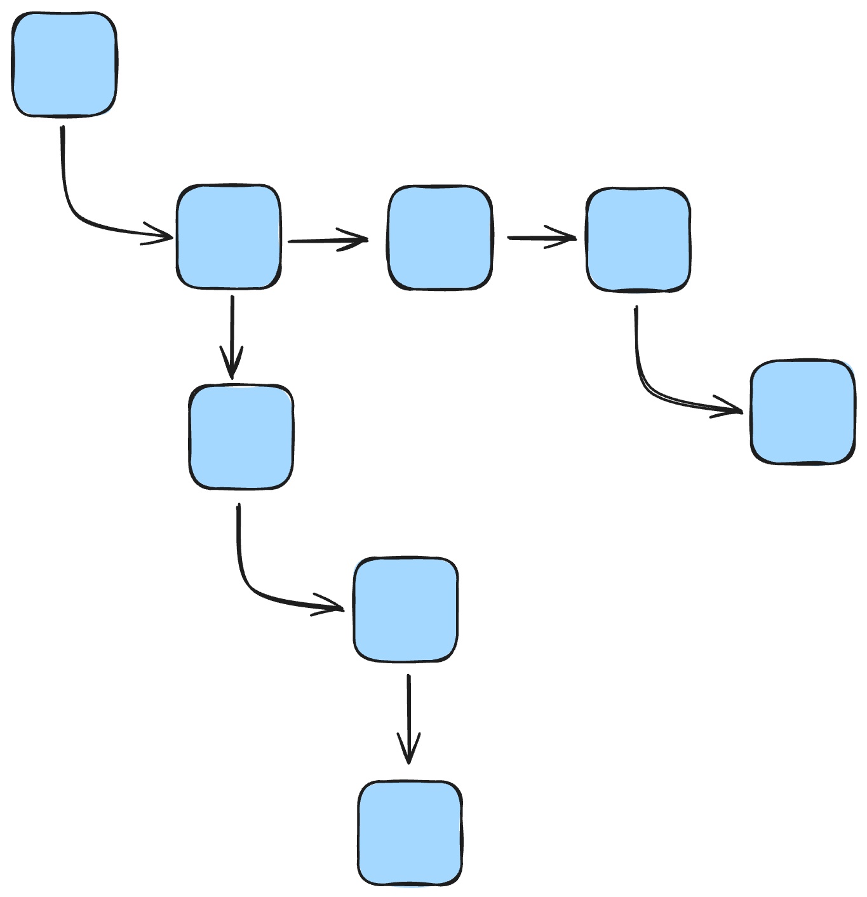
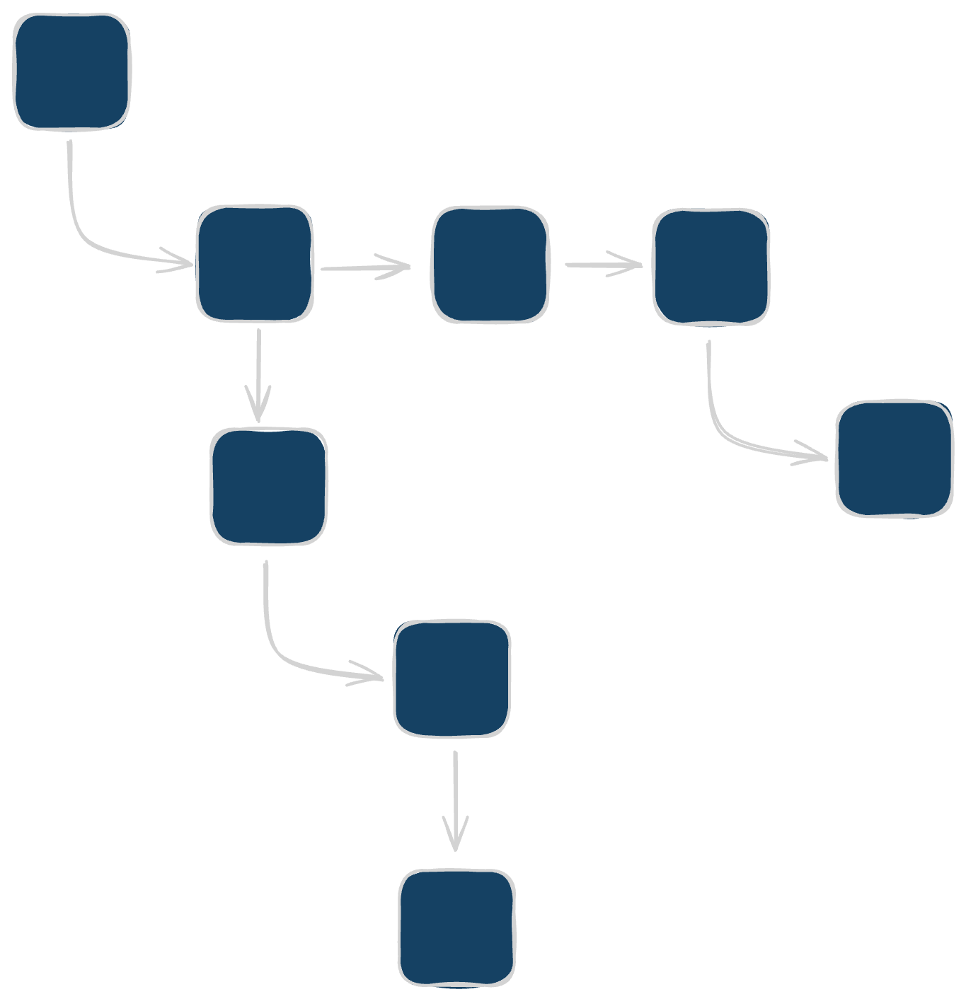
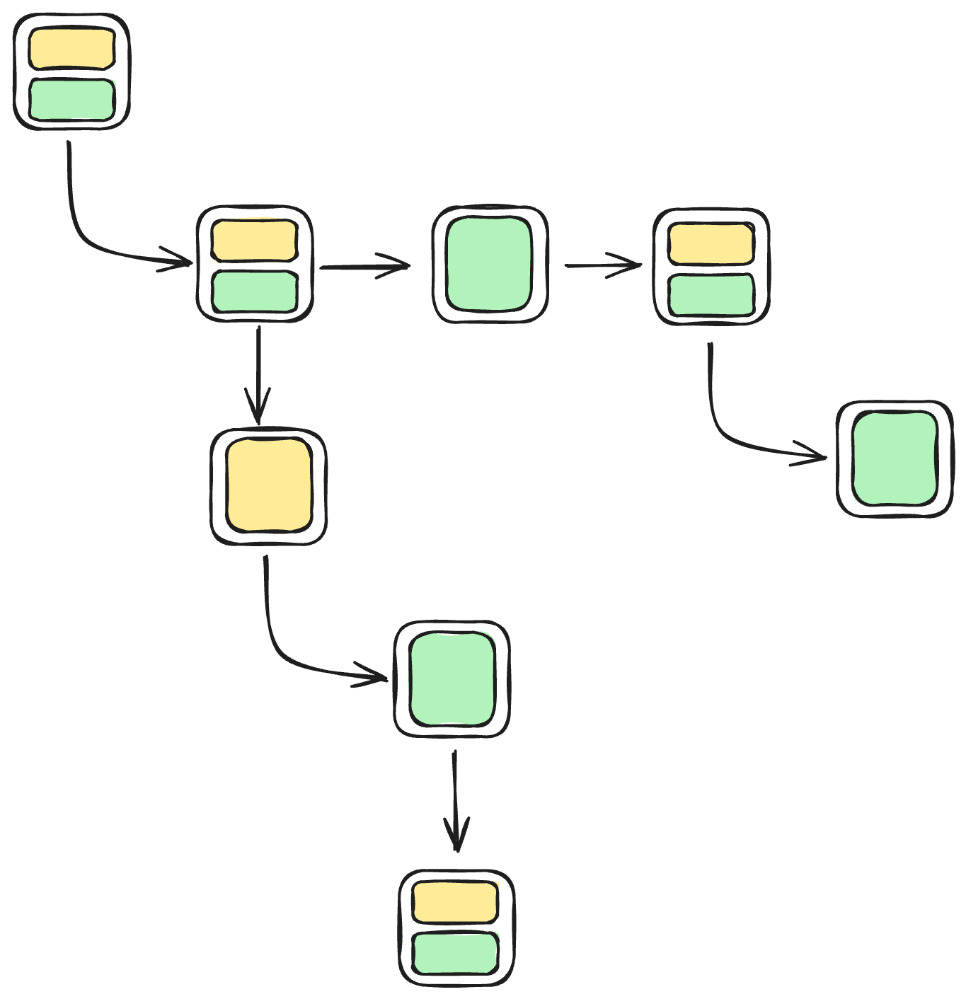
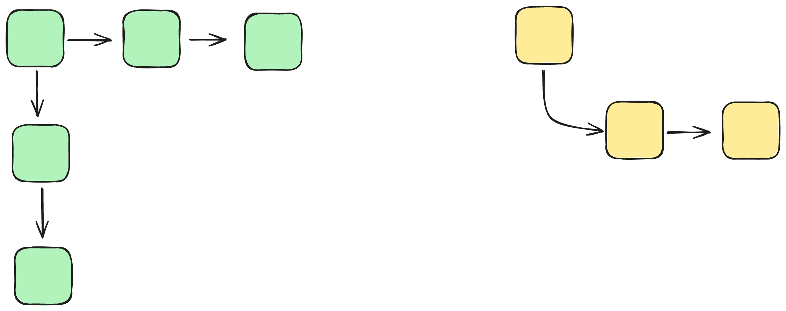
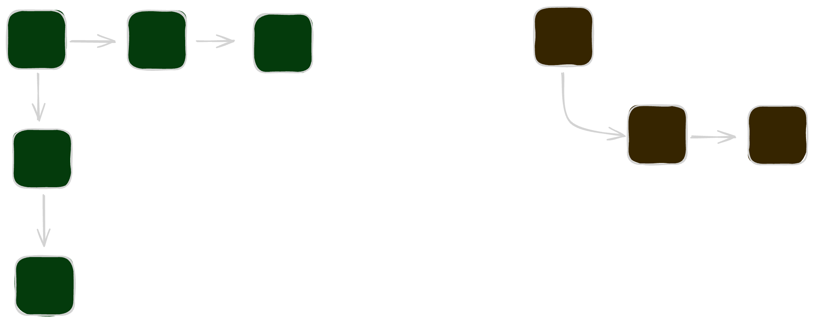

# Mental Model

Components have become the fundamental building blocks for modern application development. These components are organized into a tree structure that represents your application's UI.

{width=250px .light-only}
{width=250px .dark-only}

Each component can define UI elements, their associated styles, and manage state to handle dynamic interactions.

{width=250px .light-only}
{width=250px .dark-only}

However, not all components handle elements and state equally—some components are purely presentational (elements only), some are stateful (state only), and others combine both. As your application grows more complex and requires greater sharing of state across components, managing state within components can quickly become cumbersome. The UI tree and individual components expand significantly, making it increasingly difficult to differentiate clearly between state management and UI elements.

A better approach is to separate state management from your UI components.

{width=250px .light-only}
{width=250px .dark-only}

This separation results in a clearer, simpler UI component tree and a more manageable and organized state. By leveraging **MobX Lite** for external state management and **React** for your UI, you ensure that each tool focuses on its strength—MobX Lite effectively manages state complexity, while React excels in crafting intuitive, responsive user interfaces.
